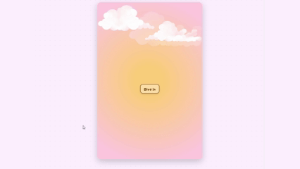
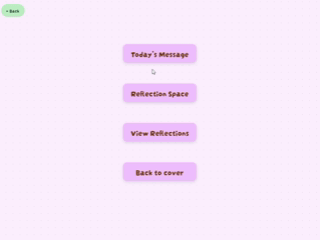
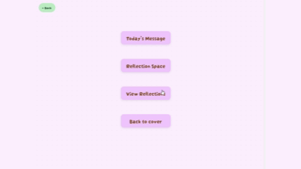

# Back to Self 🌿✨  

My project is a react cozy web application that feels like opening your own personal journal.📖✨  

## visual overview 🍃  
  

### Reflections Example 💌

  

### Back To Cover 📙

### languages 💻  
- HTML  
- CSS  
- JavaScript  

## Libraries ⭐  
- ReactJs  
- Framer-Motion  

## Features 🌟  
- Dive into your private space with a soft journal-like cover.🌸  
- Generate a unique *Message of the Day* that refreshes daily.💌  
- Write your own reflections.🖊️  
- View all your reflections.📖  
- Edit or delete reflections easily.💭
- Local storage keeps your reflections safe in your browser.💾  
- Enjoy smooth page-turn animations and calming paper-flip sounds.🍃✨  

## Managing state 💫  
Local storage handles saving and updating reflections.🌻  

## Last note 🌼  
This project is my first step into creating a mindful and comforting digital journal.🍒🌙  

Thanks for reading ♡ ⋆｡˚  
